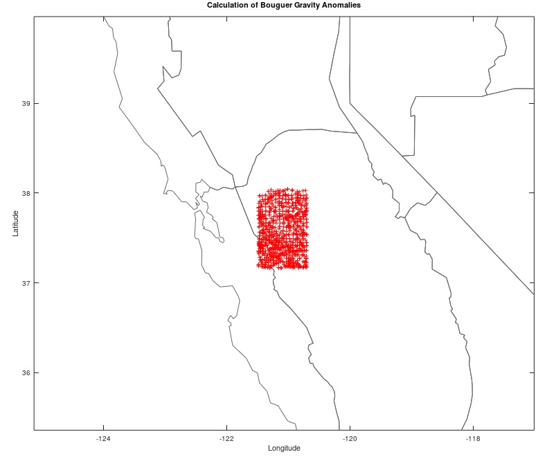
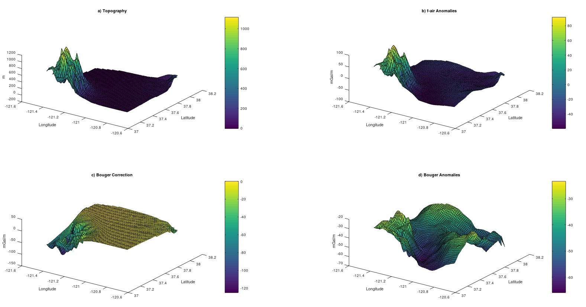

# 3D Plotting Free-Air Anomalies, Topography, Couger Correction and Bouger Gravity Anomalies in San Francisco 

## Project Statement

The aim of the project is to plot 3D **free-air anomalies, topography, bouguer correction and bouguer anomalies around San Francisco** with MATLAB. **NAD83 coordinates** used in this project.

For a more detailed explanation, please review the **Presentation.pdf** file.

## Definitions

### What is free-air anomaly?

In geophysics, the free-air gravity anomaly, often simply called the free-air anomaly, is the measured gravity anomaly after a free-air correction is applied to correct for the elevation at which a measurement is made. The free-air correction does so by adjusting these measurements of gravity to what would have been measured at a reference level. For Earth, this reference level is commonly taken as the mean sea level.

### What is topography?

Topography is the study of the shape and features of land surfaces. The topography of an area could refer to the surface shapes and features themselves, or a description (especially their depiction in maps).
Topography is a field of geoscience and planetary science and is concerned with local detail in general, including not only relief but also natural and artificial features, and even local history and culture. This meaning is less common in the United States, where topographic maps with elevation contours have made "topography" synonymous with relief.
Topography in a narrow sense involves the recording of relief or terrain, the three-dimensional quality of the surface, and the identification of specific landforms. This is also known as geomorphometry. In modern usage, this involves generation of elevation data in digital form (DEM). It is often considered to include the graphic representation of the landform on a map by a variety of techniques, including contour lines, hypsometric tints, and relief shading.

### What is bouger anomaly?

In geodesy and geophysics, the Bouguer anomaly (named after Pierre Bouguer) is a gravity anomaly, corrected for the height at which it is measured and the attraction of terrain. The height correction alone gives a free-air gravity anomaly.
Simple reduction: The gravitational acceleration outside a Bouguer plate is perpendicular to the plate and towards t, with magnitude 2πG times the mass per unit area, where is the gravitational constant. It is independent of the distance to the plate (as can be proven most simply with Gauss's law for gravity, but can also be proven directly with Newton's law of gravity). The value of is 6.67×10−11 Nm^2^ kg^-2^, so is 4.191 × 10^-10^ Nm^2^ kg^-2^ times the mass per unit area. Using 1 Gal=0.01 m s^-2^ (1 cm s^-2^) we get 4.191 × 10^-5^ mGal m^2^ kg^-1^ times the mass per unit area. For mean rock density (2.67 g cm^-3^) this gives 0.1119 mGal m^-1^.

## Dataset

The data set was given to me by the professor.

### dogu.txt dataset info:

		       long_lat_unit       degree
		      latlimit_north       38.045    
		      latlimit_south       37.167   
		      longlimit_west       -121.48    
		      longlimit_east       -120.70    
		      topography_min	   1.1603E+03 meter
		      topography_max       -2.33E+00 meter
      free-air_anomalies_min	   -6.001E+01 mGal/m
      free-air_anomalies_max	   9.255E+01 mGal/m

You can examine the area where the study was carried out by clicking on the [Google Earth](https://earth.google.com/web/search/37.6/@37.65458874,-121.25708117,19.04990239a,26212.17532162d,35y,-79.21920196h,65.59324079t,0r/data=CigiJgokCQAAAAAAAAAAEQAAAAAAAAAAGQAAAAAAAAAAIQAAAAAAAAAA) link.

## Building Algorithm for the Project

For plotting these values, we need to add dogu.txt again. We are going to drag necessery datas again.

	bfid = fopen('counties.bln');

	while feof(bfid)==0;    
	    n = fscanf(bfid,'%i,%i',2);
	    if isempty(n)==1;
	        break
	    end
	    fila = fscanf(bfid,'%g,%g',[2 n(1)]);
	    if n(1)~=length(fila(1,:));
	        fila = fscanf(bfid,'%g %g',[2 n(1)]);
	    end
	    la=fila(1,:);
	    fi=fila(2,:);
	    plot(la,fi,'Color',[.4 .4 .4],'LineWidth',1);
	    title('Calculation of Bouguer Gravity Anomalies')
	    ylabel('Latitude')
	    xlabel('Longitude')
	    hold on
	end

Using free-air anomalies (faanom) and topography (elevngvd88m) calculate Bouguer correction and Bouguer anomalies according to the rule:

**BO = -0.0419 ρ H, ΔgB = ΔgFA + BO**

Bouguer correction for average crust density inland:

$$ρ = 2.67 g/cm^3 (BO = - 0.1119 · H)$$

Bouguer correction for sea water -1.63 g/cm^3^ relatively to land, BO = + 0.0687 · depth:

$$ρ = 1.04 g/cm^3 (-1.63 g/cm^3, BO = + 0.0687 · depth) $$

	data = load('dogu.txt');
	latnad83 = data(:,3);
	lonnad83 = data(:,4);
	elevngvd88m = data(:,5);
	faanom = data(:,2);
	plot(lonnad83,latnad83,'k+'); 
	plot3(lonnad83,latnad83,elevngvd88m,'k+');

	for i = 1 : length(elevngvd88m)
	  if elevngvd88m(i) < 0
	    BO(i,1) = -0.0687 * elevngvd88m(i);	%if depths are negative numbers
	  else
	    BO(i,1) = -0.1119 * elevngvd88m(i);
	  end
	end

Firstly we need to show topography. After that we need to show bouger gravity anomalies then we need to show bouger anomalies and finally we need to show bouger correction. We can show few plots in one window at the same time with subplot(a, b, c) function. In a, we can specify rows. In b, we can specify columns and in c we can specify the location of the plot where we want to put it.

	x = -121.48:0.013:-120.70;
	y = 37.167:0.01463333333:38.045;
	[X,Y] = meshgrid(x,y);
	Z = griddata(lonnad83,latnad83,faanom,X,Y);
	surf(X,Y,Z)
	subplot(2,2,3)
	view(35,45)
	zlabel('mGal/m')#bouger correction
	ylabel('Latitude')
	colorbar
	xlabel('Longitude')
	hold on

	Z1 = griddata(lonnad83,latnad83,BO,X,Y);
	title('c) Bouger Correction') 
	surf(X,Y,Z1)
	subplot(2,2,1)
	view(35,45)
	zlabel('m')# topography
	ylabel('Latitude')
	colorbar
	xlabel('Longitude')
	hold on
	%
	Z2 = griddata(lonnad83,latnad83,elevngvd88m,X,Y);
	title('a) Topography')
	surf(X,Y,Z2)
	subplot(2,2,4)
	view(35,45)
	zlabel('mGal/m')#f-airanomalies-bouger anomalies
	ylabel('Latitude')
	colorbar
	xlabel('Longitude')
	hold on

	Z3 = griddata(lonnad83,latnad83,faanom+BO,X,Y);
	title('d) Bouger Anomalies')
	surf(X,Y,Z3)
	subplot(2,2,2)
	view(35,45)
	ylabel('Latitude')
	colorbar
	xlabel('Longitude')
	hold on

	Z4 = griddata(lonnad83,latnad83,faanom,X,Y);
	title('b) f-air Anomalies')%f-air anomalies
	zlabel('mGal/m')# f-airanomalies
	surf(X,Y,Z4)

You can see 3D plotted maps of free-air anomalies, topography, bouguer correction and bouguer anomalies using **NAD83 coordinates** below.

## Contact Me

If you have something to say to me please contact me: 

 - Twitter: [Doguilmak](https://twitter.com/Doguilmak)
 - Mail address: doguilmak@gmail.com
 